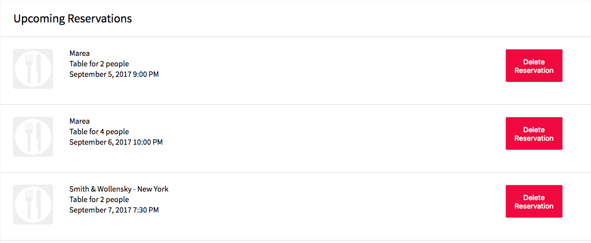
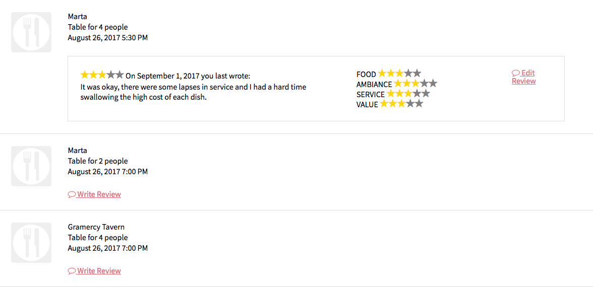
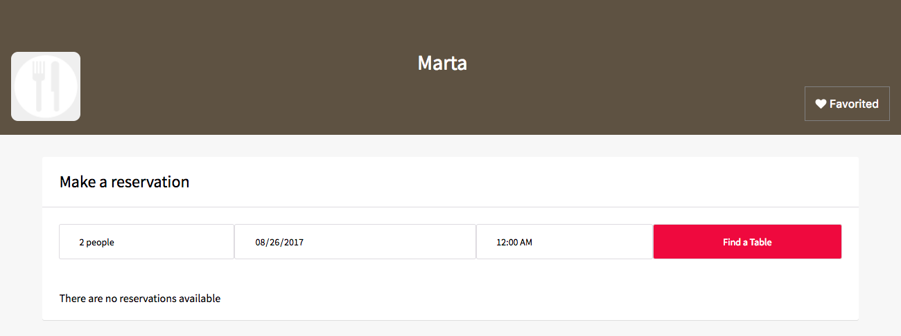

# DineRound
[Heroku Link](https://dine-round.herokuapp.com/)

DineRound is a clone of Opentable, a US-based online restaurant reservation website created in 1999 where users can reserve tables for restaurants of their choice in advance. The clone incorporates a Ruby on Rails backend for PostgreSQL database management along with a React/Redux frontend.

## Features & Implementation

The features of DineRound are broken into two main segments: profile/restaurant information and searches.

As this is mainly a site for a user to make their own reservations, much of the information being fetched from the database revolves around the current logged in user. This includes their upcoming and past reservations, corresponding reviews they made for each reservation and favorited restaurants. This is managed by profile actions in tandem with a `ProfileReducer` which helps populate all relevant information for the current user. When looking at sections of the site, the profile checks the normalized information slices of state while maintaining references to any relevant data in the profile slice of state. Through this process, the user has access to multiple features. In addition, there is a `SearchReducer` that takes care of search queries and returns information to render for any searches made, whether for restaurants or reservations. With a `uiReducer` that handles modal session forms, the `rootReducer` has these three reducers as slices of state:

```javascript
const rootReducer = combineReducers({
  entities: EntitiesReducer,
  session: SessionReducer,
  ui: uiReducer,
});
```

### Reservation History and Upcoming Reservations

Diners have both upcoming reservations and past reservations which they can review. By utilizing the `moment.js` package, the `UserProfile` component separates the incoming `reservationIds` into the two categories and renders them appropriately. This includes upcoming reservations having a cancel reservation button, while past reservations have access to creating and editing a review.

#### Upcoming reservations

#### Past reservations


### Favorites

Users can also favorite restaurants that they enjoyed, which are stored in a separate list.


### Searching tables and restaurants

Though maintaining the profile data is extremely important, a user's profile needs to be able to make reservations on restaurants in order for any use to come from the app. In order to allow that, users can search for restaurants, and each restaurant has a search form for its specific tables given parameters such as party size, time, and date. Compiled in the `SearchReducer`, the two different searches are tracked separately, with a clear search action in order to prevent previous search data from persisting.

```javascript
const nullState = { restaurants: {}, tables: {}};
const SearchReducer = (state = nullState, action) => {
  //SearchReducer code
}
```
